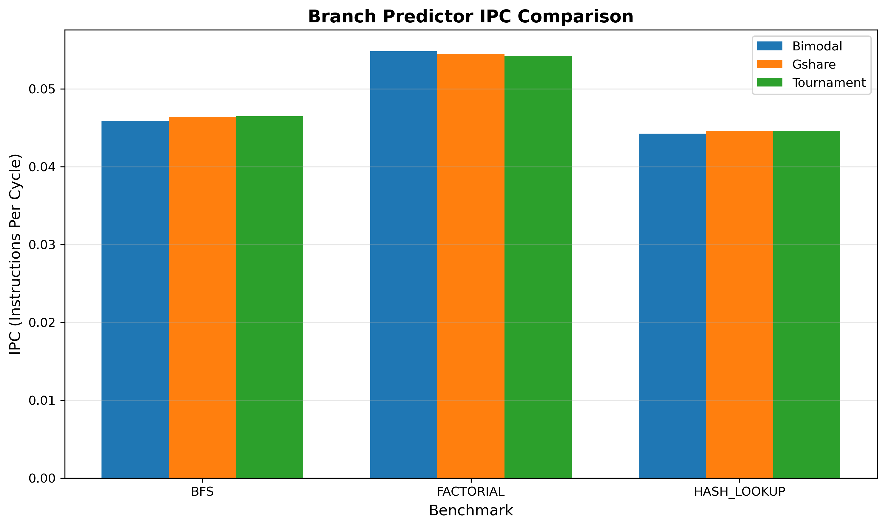
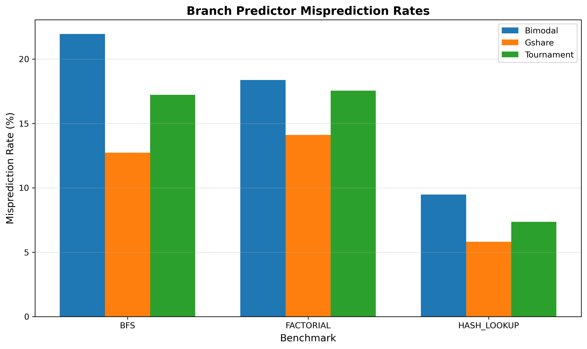
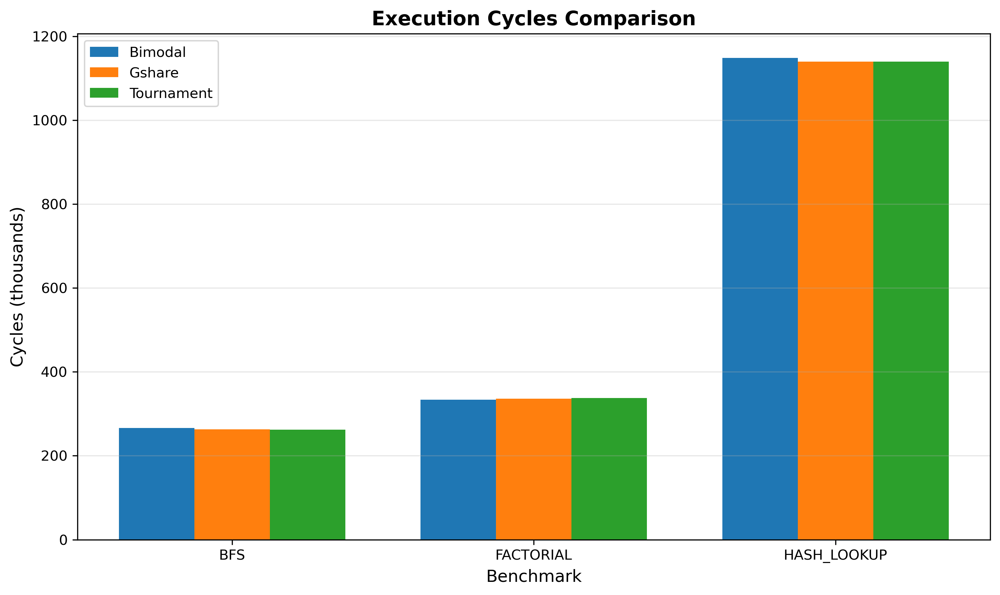

# Branch Predictor Comparison Study

Comparative analysis of branch prediction strategies on irregular workloads using gem5.

## Overview

This project compares three branch predictors (Bimodal, Gshare/LTAGE, Tournament) on workloads designed to stress prediction accuracy (graph traversal, recursion, and hash table operations). The goal is to understand which predictor performs best under different control flow patterns.

## Predictors Tested

- **Bimodal**: Simple 2-bit saturating counters (4K entries)
- **Gshare (LTAGE)**: Global history-based prediction
- **Tournament**: Hybrid local + global with meta-predictor

## Benchmarks

- **BFS**: Graph traversal with irregular branching patterns
- **Factorial**: Deep recursion with mutual recursion and fibonacci
- **Hash Lookup**: Hash table with collision chains (pointer chasing)

## Quick Results

| Benchmark   | Best Predictor | IPC    | Mispred Rate |
|-------------|----------------|--------|--------------|
| BFS         | Tournament     | 0.0465 | 17.21%       |
| Factorial   | Bimodal        | 0.0548 | 18.37%       |
| Hash Lookup | Gshare         | 0.0446 | 5.82%        |

See [detailed findings](docs/FINDINGS.md) for full analysis.

## Performance Visualizations

### IPC Comparison


Tournament wins on BFS, Bimodal on Factorial, all tied on Hash Lookup.

### Misprediction Rates


Gshare dominates on Hash Lookup (5.82%), struggles less on irregular branching.

### Execution Cycles


Lower is better - correlates with IPC results.

## Setup

### Prerequisites

- gem5 (RISC-V build)
- RISC-V cross-compiler (`riscv64-unknown-elf-gcc`)
- Python 3.8+

### Build

```bash
# Clone the repo
git clone <your-repo-url>
cd riscv-isa-extension-analysis-

# Build gem5 for RISC-V
cd gem5
scons build/RISCV/gem5.opt -j$(nproc)
cd ..

# Compile benchmarks
cd benchmarks
make
cd ..
```

## Running Experiments

### Run All Experiments

```bash
python3 scripts/run_all_experiments.py
```

This runs 9 experiments (3 predictors × 3 benchmarks) and saves results to `results/`.

### Run Single Configuration

```bash
./gem5/build/RISCV/gem5.opt \
  --outdir=output \
  src/run_branch_pred.py \
  --binary benchmarks/bfs_riscv \
  --predictor tournament
```

## Analyzing Results

### Generate Comparison Table

```bash
python3 scripts/parse_results.py
```

### Export Data

```bash
# Export to CSV/JSON
python3 scripts/parse_results.py --csv --json

# Generate graphs
python3 scripts/generate_graphs.py
```

## Project Structure

```
.
├── benchmarks/          # RISC-V test programs
│   ├── bfs.c
│   ├── factorial.c
│   └── hash_lookup.c
├── src/
│   └── run_branch_pred.py    # Main simulation script
├── scripts/
│   ├── run_all_experiments.py # Automation
│   ├── parse_results.py       # Stats parser
│   └── generate_graphs.py     # Visualization
├── results/
│   ├── bimodal/
│   ├── gshare/
│   ├── tournament/
│   └── analysis/
└── docs/
    ├── FINDINGS.md             # Detailed analysis
    └── graphs/                 # Performance charts
```

## Key Findings

- **No universal winner**: Best predictor depends on workload characteristics
- **Gshare excels at data-dependent patterns** (hash collisions)
- **Tournament most consistent** across different code types
- **Bimodal competitive on recursive workloads** despite simplicity

Irregular branching (BFS) shows largest performance variance between predictors (12.73% to 21.95% misprediction rates).

## Notes

- Used gem5 MinorCPU (in-order) for consistent comparison
- All simulations use 1 GHz clock, 512 MB DDR3 memory
- Misprediction impact would be larger on out-of-order cores

## Future Work

- Test on out-of-order CPU models (O3CPU)
- Add more irregular workloads (tree traversal, pathfinding)
- Compare with newer predictors (TAGE-SC-L, Perceptron)
- Analyze predictor table size vs. accuracy tradeoffs

## References

- gem5 documentation: https://www.gem5.org/documentation/
- Branch prediction survey: Mittal & Zhang (2019)